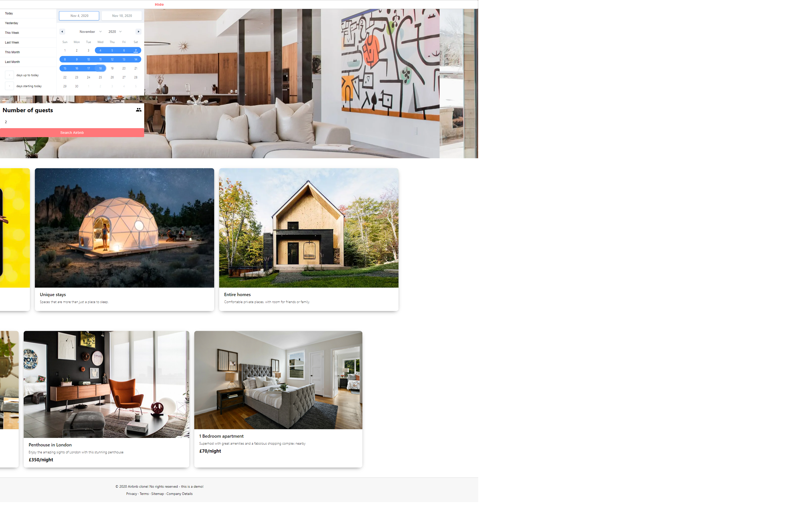
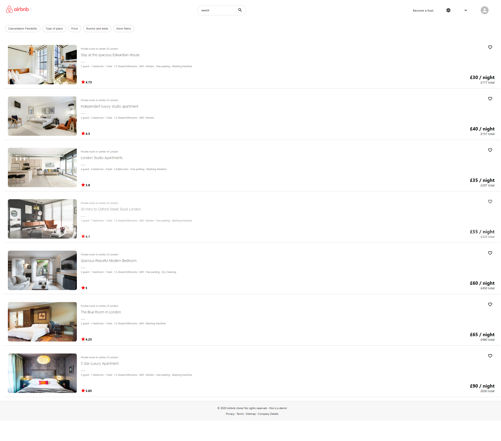

# AirBnB clone web

### 프로젝트 계획

> AirBnB 클론 코딩하며 react hooks및 간단한 props의 전달 방법 연습

> css를 사용하여 interactive한 페이지 구현

> DB서버는 없기에 props가 전달 되는 방법과 fake saerch page 구현

> react-date-range 및 date-fns를 사용하여 날짜 선택 기능 구현

> material ui 와 icon을 사용하여 css 프레임워크 사용법 익힘

> react-router-dom의 사용법을 연습

### 구현 동작

